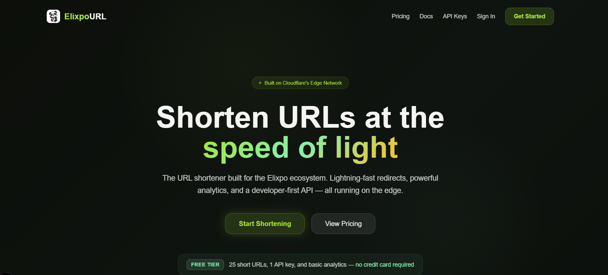

  

<h1 align="center">Elixpo-URL</h1>

  <strong>Fast URL shortener running on the edge.</strong>

## Huge thanks to [Karan](https://github.com/karanray06) from our [GDG JIS University](https://gdg.community.dev/gdg-on-campus-jis-university-kolkata-india/) community for preparing the basis foundation of the HLD with us on which we have the [Elixpo URL](https://url.elixpo.com) was built with modifications made based on scale. 

  
  
  
  
  
  

 

  

 

## What is ElixpoURL?

ElixpoURL is the URL shortener built for the [Elixpo](https://elixpo.com) ecosystem. It turns long URLs into clean, shareable short links — instantly.

Every redirect runs on Cloudflare's global edge network, meaning your links resolve in milliseconds no matter where your audience is.

## Why ElixpoURL?

- **Instant redirects** — Short links resolve at the edge, not from a central server. No cold starts, no latency spikes.
- **Click analytics** — See who's clicking, from where, on what device, and when. Understand your traffic at a glance.
- **Custom short codes** — Choose your own slugs like `url.elixpo.com/launch` instead of random strings.
- **Expiring links** — Set links to auto-expire after a date. Great for limited-time campaigns.
- **Developer-first API** — Create, read, update, and delete links programmatically with simple API keys.
- **SSO with Elixpo Accounts** — One login across the entire Elixpo ecosystem. No separate credentials to manage.

## Plans

| | Free | Pro | Business | Enterprise |
|---|---|---|---|---|
| **Short URLs** | 25 | 500 | 5,000 | Unlimited |
| **API keys** | 1 | 5 | 20 | 100 |
| **Analytics retention** | 7 days | 30 days | 90 days | 365 days |
| **Custom codes** | — | Yes | Yes | Yes |
| **Expiring links** | — | Yes | Yes | Yes |
| **Price** | Free forever | $9/mo | $29/mo | Custom |

## Get started

Head to **[url.elixpo.com](https://url.elixpo.com)** and sign in with your Elixpo account. You can start shortening URLs immediately on the free plan — no credit card required.

## API Documentation

> Full documentation is available at [url.elixpo.com/docs](https://url.elixpo.com/docs).

## Star history

<a href="https://www.star-history.com/?repos=elixpo%2Felixpourl&type=date&legend=top-left">
 <picture>
   <source media="(prefers-color-scheme: dark)" srcset="https://api.star-history.com/image?repos=elixpo/elixpourl&type=date&theme=dark&legend=top-left" />
   <source media="(prefers-color-scheme: light)" srcset="https://api.star-history.com/image?repos=elixpo/elixpourl&type=date&legend=top-left" />
   
 </picture>
</a>

---

  Made with ❤️ by the Elixpo team. Visit us at <a href="https://elixpo.com">elixpo.com</a>.

